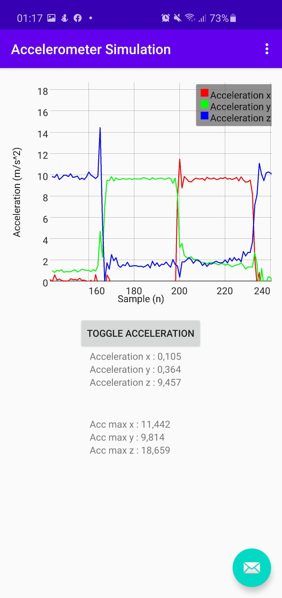

# Accelerometer Simulation 

This simulation implements a module required for the application to track the users accelerometer. The simulation measures:
- keeps a record of the acceleration experienced by the user's phone in the X,Y and Z directions
- presents the recorded the data to the user on a line graph
- presents the current and maximum experienced acceleration in each of the directions with 
- allows the user to toggle tracking of accelerometer data

*The tutorial followed for implementing a simple graph to track a accelerometer can be found [here](https://medium.com/@onyekweretrust/how-to-create-a-simple-graph-in-android-6c484324a4c1) with an alternate tutorial [here](https://github.com/halfhp/androidplot/blob/master/docs/quickstart.md).*

## Dependencies
```
dependencies {
    ...
    implementation 'com.jjoe64:graphview:4.2.2'
}
```

## App Permissions (In Manifest)
```
...
<uses-permission android:name="android.permission.WRITE_EXTERNAL_STORAGE" />
...
```


## The Application
A screenshot of the application in action is shown below, showing a rotation of the user's device along the  3 major axes.


